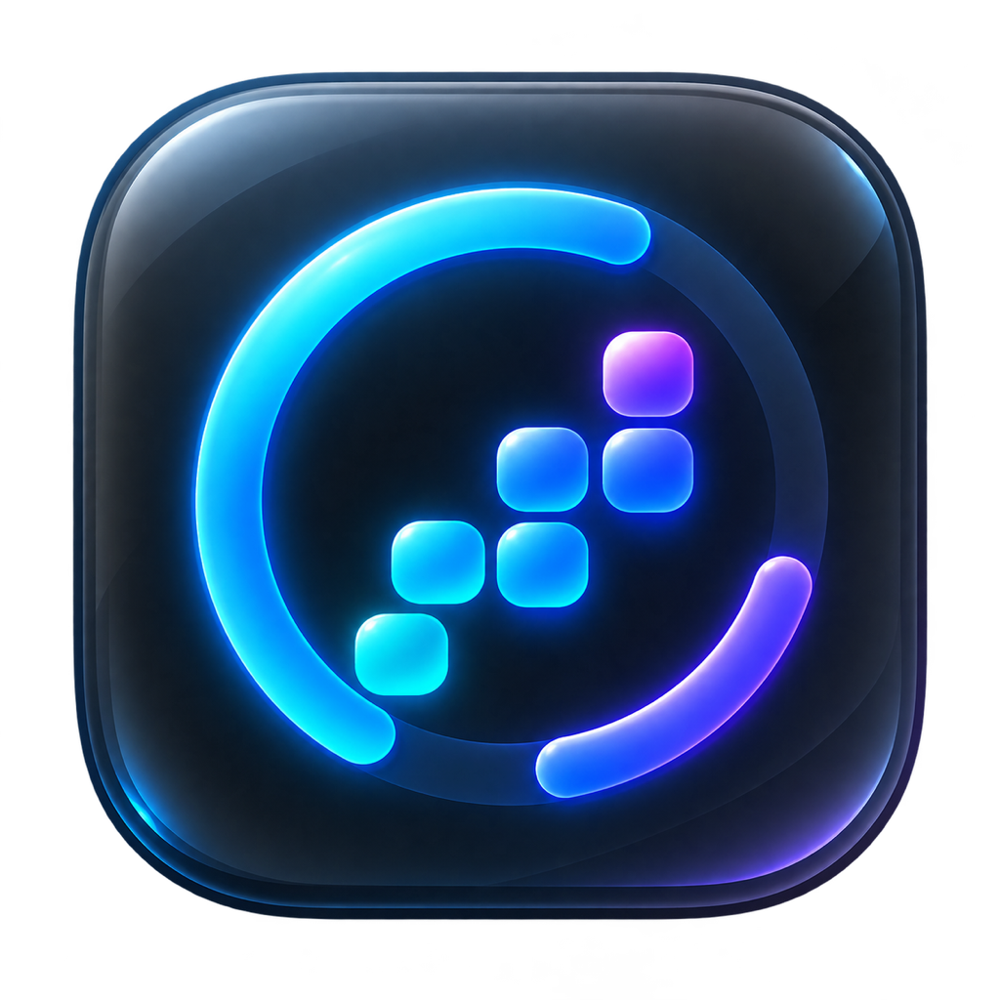

# AIusage


<p align="center">
  
</p>

AIusage is a native macOS menu-bar utility that keeps your Codex usage, limits, and reset credits visible without opening a dashboard.

## Highlights

- Independent 5-hour and weekly usage meters.
- Optional 5-hour and weekly percentages in the menu bar.
- Reset-credit list with expired credits hidden and credits expiring within three days highlighted.
- Daily, weekly, and cumulative token-usage heatmaps.
- Automatic refresh, stale-data handling, and high-usage notifications.
- Adaptive popover height, capped at two thirds of the current screen before scrolling.
- Spanish, Catalan, and English localization.
- Universal binary for Apple Silicon and Intel Macs.

## Privacy

AIusage starts the official `codex app-server --stdio` process and uses its account APIs. Authentication lives in an isolated Codex home at:

```text
~/Library/Application Support/AIusage/CodexHome
```

The app does not consume reset credits and does not read the credentials, logs, or databases of your main Codex installation. Existing data from the previous Codex Usage Bar name is migrated automatically.

## Requirements

- macOS 14 Sonoma or later.
- Codex CLI installed and available as `codex`.
- Xcode 15 or later to build from source.

## Build and test

```bash
swift test
swift run AIusage
```

Create a universal `.app` and ZIP:

```bash
./Scripts/package_app.sh
```

To sign during packaging:

```bash
APPLE_SIGNING_IDENTITY="Apple Development: Your Name (TEAMID)" \
  ./Scripts/package_app.sh
```

For Developer ID signing and notarization, configure an Apple notarytool keychain profile and run:

```bash
APPLE_SIGNING_IDENTITY="Developer ID Application: Your Name (TEAMID)" \
APPLE_NOTARY_PROFILE="your-profile" \
  ./Scripts/sign_and_notarize.sh
```

Artifacts are written to `dist/AIusage.app` and `dist/AIusage-macos-universal.zip`.

## Project structure

```text
Sources/AIusage/          SwiftUI app, Codex integration, models, and views
Tests/AIusageTests/       Usage and reset normalization tests
Resources/               Info.plist and production app-icon assets
Scripts/                 Packaging, signing, and notarization helpers
.github/workflows/       Automated test and release workflow
```

## Release

The current release is **v1.0.0**. Version tags matching `v*` run the test suite, build the universal app, and publish the ZIP through GitHub Actions.

## License

AIusage is available under the [MIT License](LICENSE).
